

<h1>

Smart India Hackahton 2022

</h1>

<!-- PROJECT LOGO -->

  

  <h2 align="center"><strong>ROLL CALL</strong></h2>

  
Mark and monitor attendance in a smooth and secure manner.

  <strong>·</strong>
    <a href="" download rel="noopener noreferrer" target="_blank" >
      Download Apk
    </a>
    &nbsp &nbsp &nbsp &nbsp
   <strong>·</strong>
    <a href="https://github.com/vedantkulkarni/grand_finale_sih/issues">Report Bug</a>
    &nbsp &nbsp &nbsp &nbsp
     <strong>·</strong>
    <a href="https://github.com/vedantkulkarni/grand_finale_sih/issues">Request Feature</a>
  

<!-- ABOUT THE PROJECT -->

## About The Project

This is the project made by the team **Dart Knights** during the grand finale of the <a href="https://www.sih.gov.in/">Smart India Hackathon 2022</a>. Problem statement for the project was given by **Government of Maharashtra**.

### Team Members:

1. <a href="https://github.com/vedantkulkarni">Vedant Kulkarni </a>(Team Leader)

2. <a href="https://github.com/atharv-bhadange">Atharv Bhadange </a>

3. <a href="https://github.com/Harshwardhan431">Harshwardhan Atkare </a>

4. <a href="https://github.com/Koosta02">Namit Surana </a>

5. <a href="https://github.com/anushree01bajaj">Anshree Bajaj </a>

6. <a href="https://github.com/suyogkokaje">Suyog Kokaje </a>

### Problem Statement :

Every year number of students take admissions into government aided schools. Currently the attendance system for the students is done manually. 
Hence requirement of a robust and low-cost system is needed. Addressing this problem will ensure the proper attendance and will help teachers in taking attendance.

## Screenshots

### Mobile 

|                                                                        |                                                                        |
| ---------------------------------------------------------------------- | ---------------------------------------------------------------------- |
| 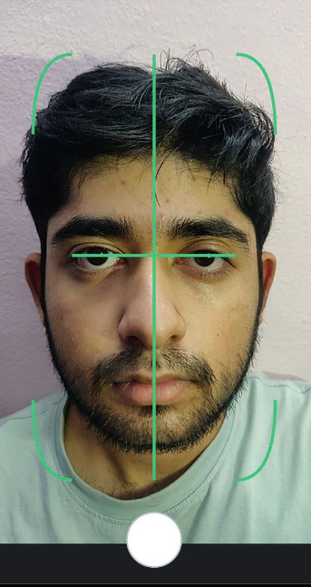 | 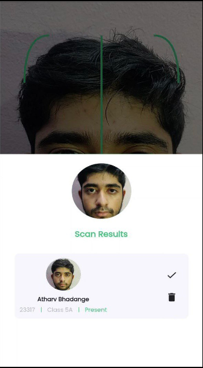 |

|                                                                        |                                                                        |
| ---------------------------------------------------------------------- | ---------------------------------------------------------------------- |
| 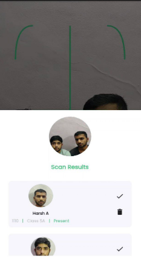 | 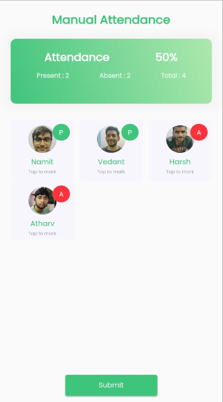 |
|                                                                        |                                                                        |
| ---------------------------------------------------------------------- | ---------------------------------------------------------------------- |
| 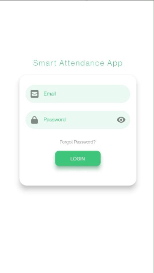 | 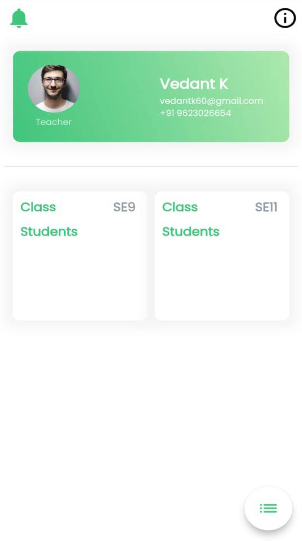 |

|                                                                        |                                                                        |
| ---------------------------------------------------------------------- | ---------------------------------------------------------------------- |
| 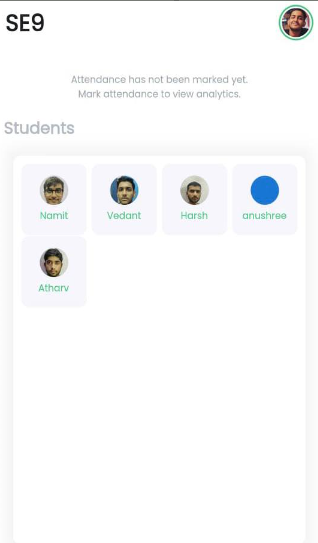 | 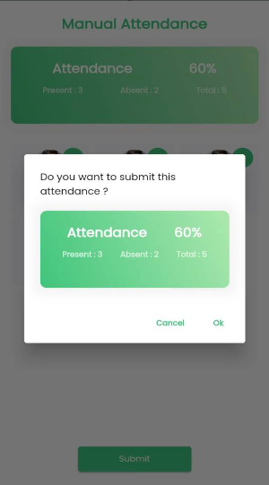 |

 

### Desktop

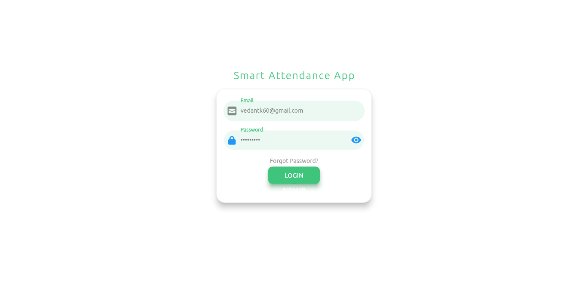
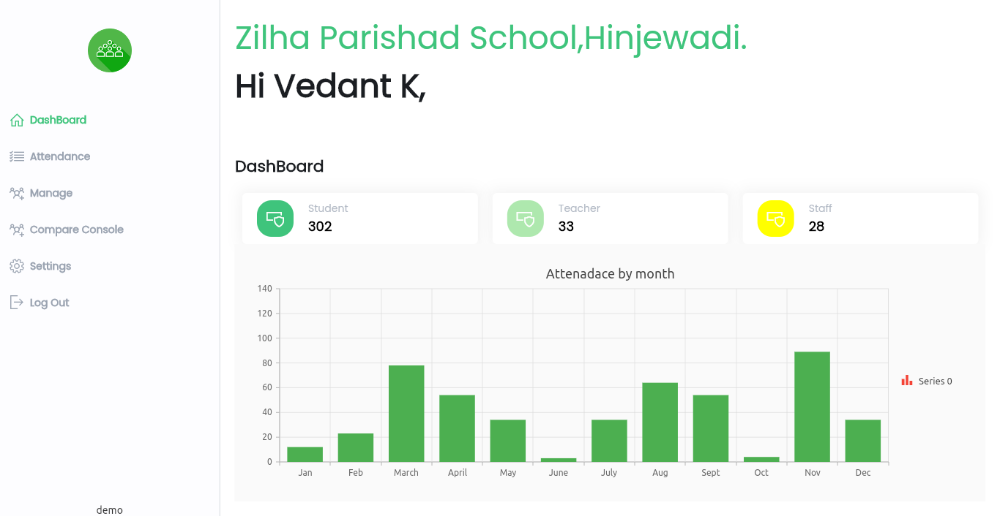
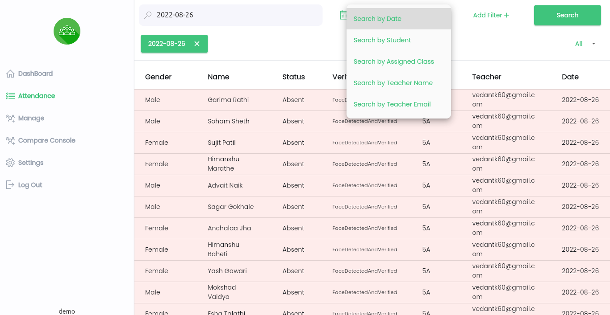
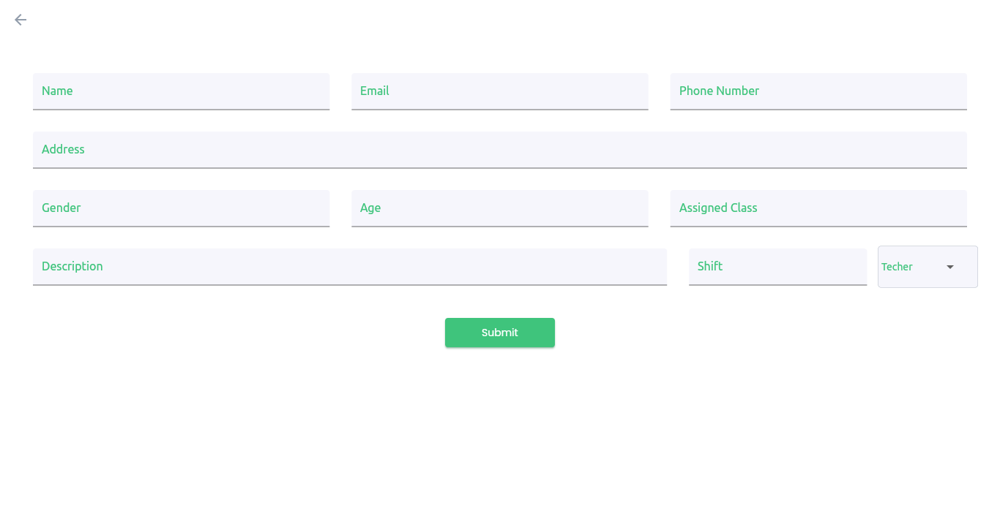
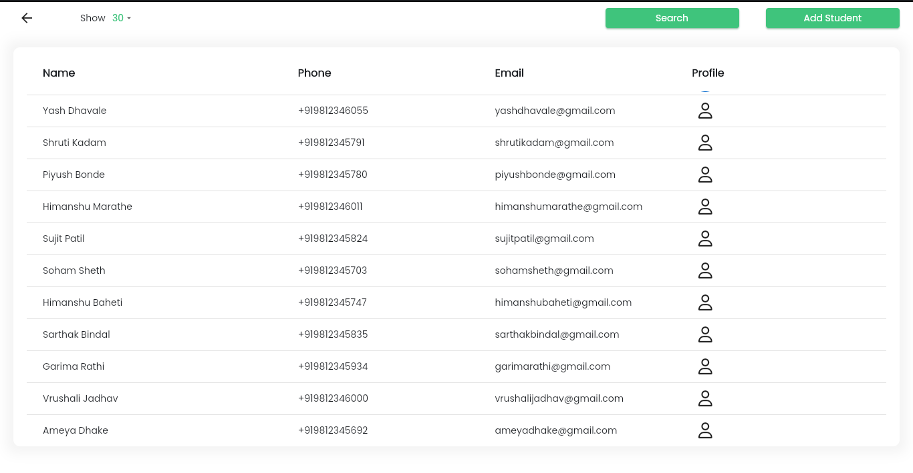
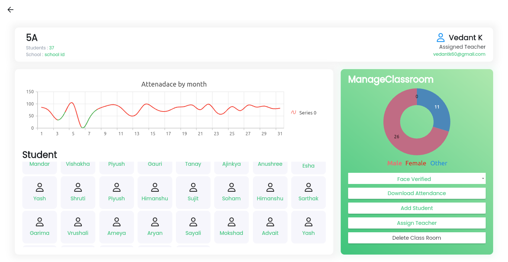
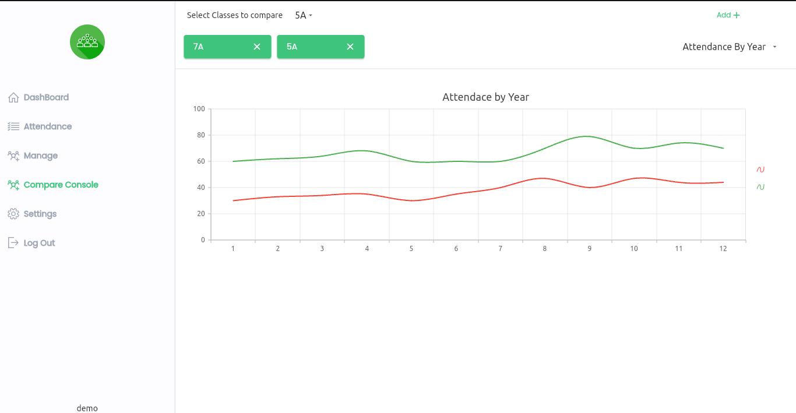
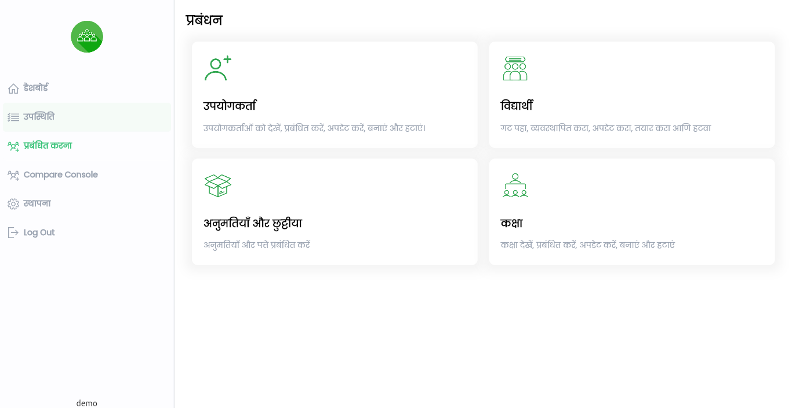
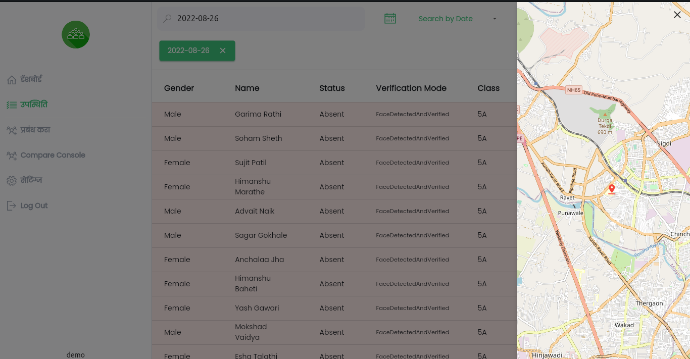

### Features:
<strong>1. Face Detection and Recognition: </strong>

 Attendance is marked by scanning student's face through the app. Teacher can also mark attendance of more than one students at a time by scanning multiple faces simultaneously. FaceNet is used for that purpose. You can read more about FaceNet <a href="https://arxiv.org/pdf/1503.03832.pdf">here</a>.

<strong>2. Robust Search Filters: </strong>

 You can get any specific inofrmation regarding attendacne of any student you want according to your need by appying various search filters. This feature is implemented using AWS Opensearch.

<strong>3. Teacher's location verification: </strong>

 Location of the teacher will be recorded while marking the attendance of the students.

<strong>4. Graphical Statistics: </strong>

 Various kind of information regarding the attendance is displayed in the form of different graphs such as bar graphs, pie charts, etc.

<strong>5. OneTap Attendance: </strong>

 In case if some kind of glitch is introduces while scanning the face, then teacher can take attendance manually just by tapping on the student card. By default all students will be marked present. If any of the students is absent then teacher have to tap on his profile card to mark it as absent.

<strong>5. Downloadable Attendance Report: </strong>

 Once the attendance is recorded, the report of the attendance can be downloaded in the form of .csv file

<strong>6.Local attendance backup in case of network issue: </strong>

 At some places there is the issue of the connectivity. So it is not possible to upload the attendance instantly. This app provides facility to submit the attendance instantly. The attendance is stored locally until the connectivity is recovered.

### Built With

(<a href="#top">back to top</a>)

